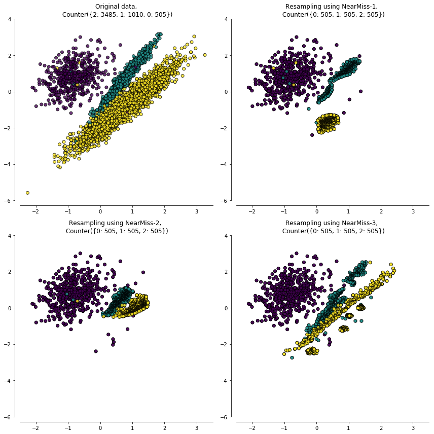

**过采样方法**

**随机过采样**
将从少数类中随机抽取样本放入数据集中。

做法简单，但是因为大量的重复，容易引起过拟合。

**1、SMOTE方法**

SMOTE方法全称为*Synthetic Minority Oversampling Technique*，它的思想为，在少数类中，通过KNN的手段来进行插值。
下面举例说明：

假设少数类有N个样本，我们需要m*N个新样本，那么

1. 计算每个少数类样本$x_i$的k个临近样本
2. 从$x_i$的k个样本中随机选取一个样本$x_t$
3. 生成一个0~1的随机值，通过如下公司进行插值
4. $x_{t\_new}=x_i + random(0,1)*(x_i-x_t)$
5. 将每个少数类样本按照步骤2~4重复m遍即可

该方法为SMOTE-Regular方法，针对边界、盲区等也有一些改进算法，常见有SMOTE-Borderline1, SMOTE-Borderline2, SMOTE-SVM等。

它的优点在于具有一些泛化能力，缺点在于
* 如果k近邻都是少数类样本，那新样本可能不会带来太多信息。
* 如果k近邻都是多数类样本，那么该点可能为噪声。或者与其他多数类样本点重合，引起分类困难。

**2、ADASYN方法**

ADASYN全称为*Adaptive Synthetic*，它也是SMOTE方法的一个改进版。SMOTE方法中生成新样本时，对于每个少数类样本的权重是一样的。而ADASYN是给予了不同的权重，它认为在k个最近邻中多数类多一些的情况下，能够获取的信息更多，所以应该生成更多的样本。其生成步骤如下：

1. 统计数据集中少数类和多数类的个数，分别记为$m_s,m_l$。
2. 计算数据集的不平衡度，即，$d = \frac{m_s}{m_l}，d\in(0,1]$
3. 当$d < d_{th}$时，生成新样本。其中$d_{th}$是预设的阈值，表示正负样本不平衡的上限。
4. 计算需要生成的新样本数，$G=(m_l - m_s)*\beta$。其中$\beta\in (0,1]$是新样本集中正负样本的平衡参数。
5. 统计每个少数类样本的k个近邻中，多数类的个数$\Delta_i$，并计算比例$r_i=\frac{\Delta_i}{k}$。
6. 计算出每个少数类样本比例在所有少数类样本中的权重，即，$\hat{r_i}=\frac{r_i}{\sum_{j=1}^{m_s}r_j}$
7. 计算每个少数类样本需要合成的新样本数，即，$g_i = G * \hat{r_i}$。
8. 每个少数类样本$x_i$从k个最近邻中随机选取一个少数类，使用SMOTE公式来生成新样本，循环$g_i$次。

**降采样方法**

**1、随机降采样**

从多数类中随机丢弃一些样本

优点在于简单，缺点在于可能会损失很多信息。

**2、Tomek Links**

如图所示，当一个样本点和它的最近邻点的类别相反时，这个点就为Tomek Links点，这个算法认为可以将这两个点中多数类别的点去掉。因他认为这样的点对模型来说比较难区分，不如删掉一个，减轻压力。缺点在于1）计算量大，2）会损失信息，3）清除的样本有限。

**3、Edited Nearest Neighbours(ENN)**

对于一个多数类样本来说，如果它的k个近邻点中，一半都不属于多数类，那么就将这个点清除。

**4、EasyEnsemble**

假设多数类个数为n，少数类个数为m，那么先将n个多数类样本随机划分为k个子集，每个子集中的多数类个数为m。即，在子集中，多数类和少数类样本的比例就为1：1了。此时再根据这k个子集，分别训练k个弱分类器，最终预测时将k个分类器的结果相加，得到最终结果。

**5、BalanceCascade**  

它也是每次抽取一个数据子集，其中包括全部的N个少数类样本，和N个多数类样本，然后训练一个基分类器，将所有基分类器应用于所有的多数类样本上，如果预测正确，则将其去掉。这样做的目的是让模型更关注分类错误的样本。

**6、NearMiss**

它的思想是在多数类样本中选取更具有代表性的，为了缓解欠采样中信息损失的问题。它根据一些启发式规则来选择样本，根据规则的不同可分为3类：
1. 对每个多数类样本，计算出离它最近的k个少数类样本的距离均值。并在全部多数类样本中选出最近的N个样本。
2. 对每个多数类样本，计算出离它最远的k个少数类样本的距离均值。并在全部多数类样本中选出最近的N个样本。
3. 对于每个少数类，选出距离最近的k个多数类样本。目的是保证少数类样本都被多数类样本包围着。

方法1和方法2计算量比较大，因为要计算每个多数类的k个近邻距离。方法1对异常值比较敏感，特别是离群值。方法3效果最好。

**过采样和欠采样结果**

如上所说，SMOTE算法的缺点是生成少数类样本点会和多数类样本点重合，引起分类困难。而Tomek Links和ENN刚好可以消除边界上的多余点，那么就可以将这2类方法建立成一个pipeline，先过采样，再消除边界值。其中SMOTE+ENN可以清除更多的重叠样本。